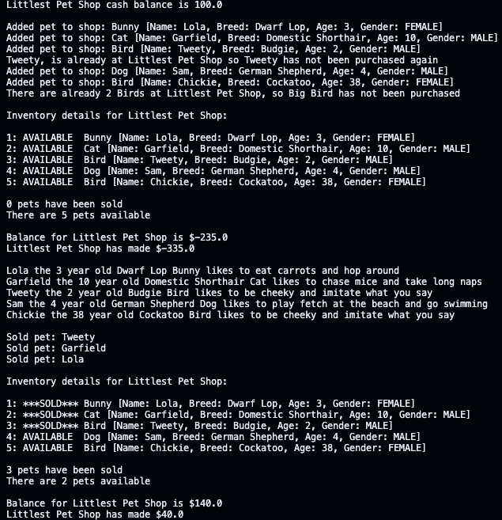

## Pet Store Project

A program that can

- Track the Pet Store's cash balance
- Reduce the cash balance when a new pet is purchased by the store; the store can not have more than 2 pets that are the same species
- Increase the cash balance when a pet is sold by the store
- Print the current inventory of the store and details of how many pets were sold and are available
- Print the personalities of each pet 

I wrote this program to practice using abstract classes and OOP concepts I have learned.

The ouput of the program with the current Main.java code

