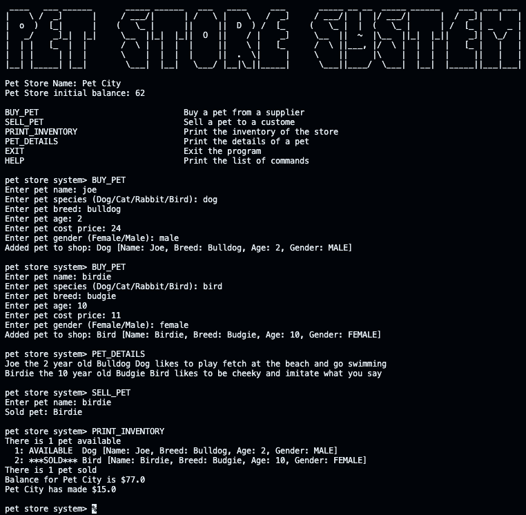

# Pet Store Project
A Pet Store inventory system written in Java that makes use of OOP concepts and the factory design pattern. The system takes user commands and is able to store information about pets and the Store's cash balance. 

## Program Functionality
#
- Track the Pet Store's cash balance
- Reduce the cash balance when a new pet is purchased by the store; the store can not have more than 2 pets that are the same species
- Increase the cash balance when a pet is sold by the store
- Print the current inventory of the store and details of how many pets were sold and are available
- Print the personalities of each pet 

## Example of functionality
#
